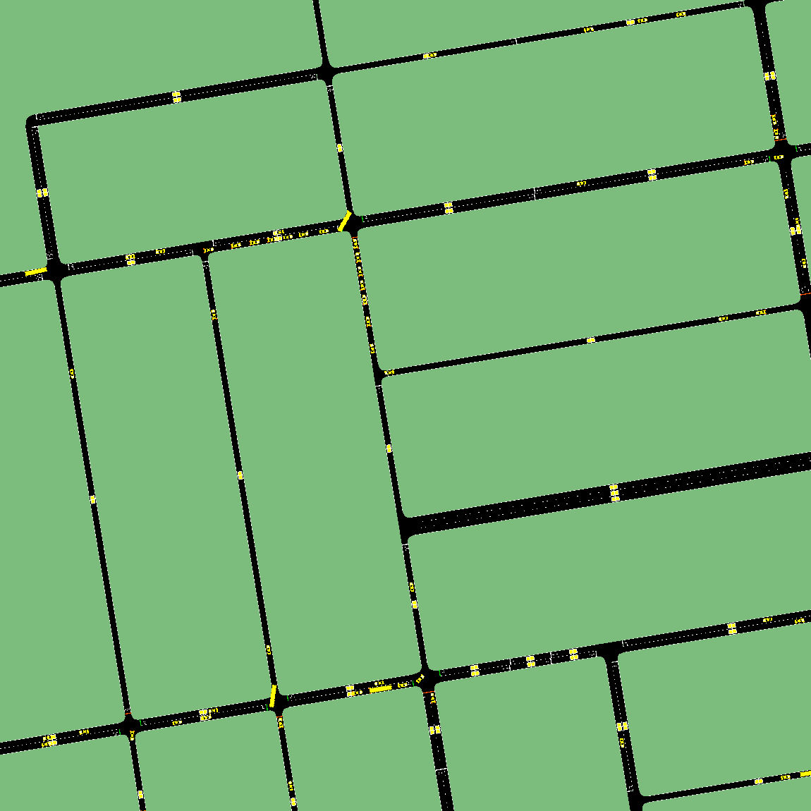

# TRANSIT

## Introduction

**Tr**affic **An**omaly **Si**mulation **T**ool (TRANSIT) is a simulation tool which aims to generate cross-scale unified, reproducible, and controllable urban road traffic anomaly scenarios, with detailed multimodal traffic anomlay simulation datasets. TRANSIT can be used in vaious urban road network scenarios, including real-world road networks, and supports diverse types of traffic anomalies.


 **Theoretical street network with road speed limit anomaly**



 **Real-world street network with traffic light failure anomaly**

## Installation

* TRANSIT is developed based on SUMO—a widely used, open source traffic simulation tool. SUMO environment should be prepared firstly, you can follow the instruction of the following page:

  [Downloads - SUMO Documentation](https://sumo.dlr.de/docs/Downloads.php)
* Please note that TRANSIT utilizes the system variable SUMO_HOME to call SUMO, therefore the **SUMO_HOME** must be set to the correct SUMO installation path. You can follow the instructions to add the system variable:

  [Computer Skills - SUMO Documentation](https://sumo.dlr.de/docs/Basics/Basic_Computer_Skills.html#sumo_home)
* TRANSIT is a python program, python>=3.8 environment should be installed. You can download python or using Anaconda is recommended.

  [Download Python | Python.org](https://www.python.org/downloads/)

  [Download Anaconda Distribution | Anaconda](https://www.anaconda.com/download)
* Packages like traci, numpy should be installed, which are listed in *requirements.txt .* You can install these third-party packages using the following command:

  ```bash
  pip install -r requirements.txt
  ```

## Usage

TRANSIT's entrypont is at `src\run.py`. You can simply run the following command line to get a demo:

```bash
python src/run.py
```

To customize the simulation, you may:

1. Adjust the **scenario and anomaly names** in `src\run.py`
2. Modify or create the corresponding **configuration files** (`.ini`) in the `config` folder.

You can download real world maps and put it in the `inputs` folder, then specify the file in `ini` file. TRANSIT will automatically convert it and use it in the simulation. Fine-tuning the map in `models\yours_cenario\road.net.xml` using Netedit tool of SUMO is optional.

# Dataset

TRANSIT provides multi-modal datasets, including: fixed detector data, floating car data and  event sequence data. If you run the `src\run.py` you can find your dataset in `datasets` folder. We also provide a default dataset at [TRANSIT multimodal dataset](https://www.kaggle.com/datasets/bigzeze/transit-dataset/data).

## Todo

Multi-process support is being developed to mass-produce diverse anomaly-injection scenarios and datasets from one configuration, enhancing training data for deep learning models and enabling integration and evaluation of active traffic control systems.
